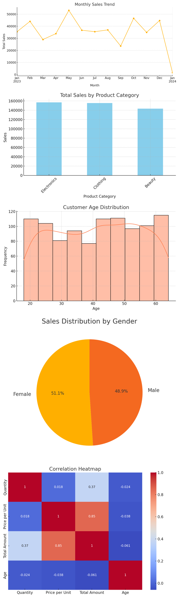

# 📊 OIBSIP - Exploratory Data Analysis on Retail Sales

> Level 1 Task - Data Analytics Internship at Oasis Infobyte

## 📝 Project Description

This project involves performing **Exploratory Data Analysis (EDA)** on a retail sales dataset. The goal is to uncover meaningful insights and patterns that can help a retail business make informed decisions.

By analyzing sales trends, customer behavior, and product performance, this project highlights the importance of data-driven strategy in retail environments.

---

## 📂 Dataset

We used a retail sales dataset available on Kaggle containing transaction-level data, including:

- Customer ID  
- Product Category  
- Purchase Amount  
- Date of Purchase  
- City/Region  
- Payment Method  

---

## 🔑 Key Concepts & Challenges

- **Data Loading & Cleaning**: Handled nulls, removed duplicates, corrected data types.  
- **Descriptive Statistics**: Calculated central tendencies and spread (mean, median, std. deviation).  
- **Time Series Analysis**: Identified seasonal patterns and trends.  
- **Customer/Product Analysis**: Analyzed top customers, regions, and popular products.  
- **Visualizations**: Created bar plots, line plots, heatmaps, and pie charts.  
- **Recommendations**: Derived insights for improving business strategy.

---

## 📈 Visualizations Included

- Monthly Sales Trends  
- Product Category Popularity  
- Customer Age Distribution  
- Gender-based Sales Distribution  
- Correlation Heatmap  



---

## 🛠️ Technologies Used

- Python  
- Pandas  
- Matplotlib  
- Seaborn  
- NumPy  
- Jupyter Notebook  

---

## 🎯 Learning Outcomes

- Hands-on experience with real-world data analysis  
- Enhanced skills in EDA and data storytelling  
- Visualization techniques to communicate insights effectively  

---

## 📎 How to Run

1. Clone this repo  
2. Make sure required libraries are installed:
```bash
pip install pandas matplotlib seaborn numpy pillow fpdf
```
3. Run `retail_sales_eda.py` or open in Jupyter Notebook to explore the analysis and visualizations

---

## ✅ Output

A complete EDA report with actionable recommendations for marketing, inventory management, and customer retention.

---

## ✨ About Me

I'm **Sai Krishna Thukaram Munde**, exploring **Python**, **Web Development**, **Android**, **Data Analytics**, and **Data Science** through real-world projects. 

Let’s connect:

- 🌐 [LinkedIn](https://www.linkedin.com)  
- 📧 saimunde0804@gmail.com
